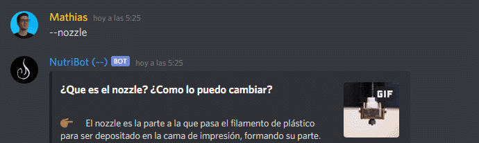

<h1 align="center">
  <br>
  <strong>Nutriabot</strong>
  <br>
</h1>
<h2 align="center">  </a>
</h2>
<h4 align="center">Bot de Discord para canales de Youtube, orientado a impresión 3D.</a>.</h4>

<p align="center">
  <br>
    
  <br>
</p>

El bot viene con comandos inicales dedicados a temas básicos de impresión 3D (Conceptos como nozzle)

## Funciones principales

- Mensaje de ayuda (--ayuda)
- Explicaciones sobre diversos conceptos relacionados a la impresión 3D
  - Nozzles
  - Cambio de filamento
  - Extrusor
  - Firmware
  - Hotend
  - Tipos de impresoras
  - Libros de impresión 3D
- Funciones de moderación
  - Contador de usuarios
  - Eliminación masiva de mensajes
  - Recarga de comandos

## Ejemplos

<p align="center">
    
  <br>
  </a>
  <br>
  </a>
  <br>
</p>

## Stack

- [DiscordJS](https://discord.js.org/)
- NodeJS
- Javascript

## Instalación

1. Clonar repositorio

    ```
    git clone git@github.com:lihuelworks/nutriabot.gite
    ```

2. Instalar dependencias
   1. [NodeJS](https://nodejs.org/en/download/)
   2. [DiscordJS](https://github.com/discordjs/discord.js) (en raiz de proyecto):

        ```c
        npm install discord.js
        ```
3. Armar una app en Discord, yendo [a Discord Developers](https://discord.com/developers/applications):

    

4. Copiar el "secreto" (token) para habilitarla:

    
    <br>
5. Crear archivo config.json en raíz de proyecto. Éste va a tener el **prefijo de tu bot** (en éste caso, "--"), y el **token recién copiado**:

    ```
    {
	  "prefix": "--",
	  "token": "PEGAR ACA TOKEN COPIADO"
    }
    ```
    - NOTA: Pegar el token en cualquier repositorio/red social/plataforma pública resultará en el token **siendo re-instanciado**, invalidando el token anterior. Discord enviará un mensaje a su cuenta si ésto sucede.
6. Una vez hecho ésto, se puede iniciar el bot usando:

    ```
    npm start
    ```

# Uso y customización

La idea del bot es que los comandos e información presentada en ellos pueda ser personalizada y escalada a conveniencia del usuario. Para ello, se utiliza un "handler" dinámico.

En terminos prácticos, ésto significa que cualquier archivo JS dentro de `./commands` que posea un `module.exports` sea tomado como comando, usando `execute(message, args) { ... }` como función de ejecución.

El comando puede tener distintas keys/campos, que añaden funcionalidad al mismo:
* **Aliases:** Permiten llamar al comando por otro nombre que no sea el del mismo archivo, usando un campo (`aliases:`) con un array de strings (Con cada alias siendo un string). Ejemplo, dentro de `avatar.js`
    ```
    module.exports = {
      name: 'avatar',
      description: 'Get the avatar URL of the tagged user(s), or your own avatar.',
      aliases: ['icon', 'pfp'],
      ...
    }
    ```

* **Argumentos requeridos:** Permiten una forma general de chequear la necesidad de argumentos para el funcionamiento de un comando (en vez de necesitar un `if` por cada chequeo). Basta con añadir el campo `args` usando un valor booleano de `true` si se requieren argumentos, o `false` si no (aunque en ese caso se puede omitir el campo sin ninguna otra consecuencia). otro nombre que no sea el del mismo archivo, usando un array de strings (Con cada alias siendo un string). Ejemplo:
    ```
    module.exports = {
      name: 'args-info',
      description: 'Comando de test que necesita argumentos.',
      args: true,
      ...
    }
    ```
* **Uso esperado del comando:** Permite corregir al usuario, en caso de un misuso de un comando, con el uso esperado del mismo. Funciona en conjunto, por ejemplo, con **"Argumentos requeridos"**. El campo es un string de texto donde el usuario puede añadir una explicación del comando. Ejemplo (continuando del código anterior):
    ```
    module.exports = {
      name: 'args-info',
      description: 'Comando de test que necesita argumentos.',
      args: true,
      usage: '<user> <role>',
      ...
    }
    ```
* **Uso único en el server (GuildOnly):** Cualquier usuario que pertenezca a un server donde el bot esté implementado, puede también usar el mismo en mensajes privador (o DMs). Para evitar ésto, se puede añadir el campo `guildOnly` con un booleano `true`:
    ```
    module.exports = {
      name: 'kick',
      description: 'Kick a user from the server.',
      guildOnly: true,
      ...
    }
    ```
* **Cooldowns:** Permite evitar el spam de comandos, usando `cooldown` con el número de segundos que debe existir entre cada llamada del comando de un usuario individual (no llamadas en general de un canal de texto). Si ningún campo es aclarado, se usará un default de 3 segundos.
  ```
    module.exports = {
      name: 'ping',
      cooldown: 5,
      ...
    }
    ```
* **Permisos:** Algunos comandos tienen demasiado impacto sobre los mensajes de un canal como para ser usados por el común de los usuarios. Para ello, es posible agregar el campo `permissions` junto con una flag (o bandera) que defina que permisos necesita el usuario para usar el comando. Ejemplo con `prune.js`
  ```
    module.exports = {
      name: 'prune',
      description: 'Bulk deletes n number of messages per number in argument',
      permissions: 'MANAGE_CHANNELS',
      ...
    ```
    - NOTA: Puede ver una lista todas las flags usadas en DiscordJS [aquí](https://discord.js.org/#/docs/main/stable/class/Permissions?scrollTo=s-FLAGS).
* **Recarga de comandos:** En caso de hacer modificaciones sobre algún comando específico bajo `./commands`, es posible recargarlo sin necesidad de reiniciar el servidor donde está alojado el bot. Para ello, basta con usar `--reload` junto con el nombre del comando. Ejemplo:
  ```
    module.exports = {
      name: 'prune',
      description: 'Bulk deletes n number of messages per number in argument',
      permissions: 'MANAGE_CHANNELS',
      ...
    ```
Para más información, puede consultar a la [documentación de DiscordJS](https://discord.js.org/#/docs/main/stable/general/welcome) o [la guía creada alrededor de la misma](https://discordjs.guide/).

# Redes
- [ ] poner banner inline con redes y logo de cafecito

<a href='https://cafecito.app/lihuelworks' rel='noopener' target='_blank'></a>